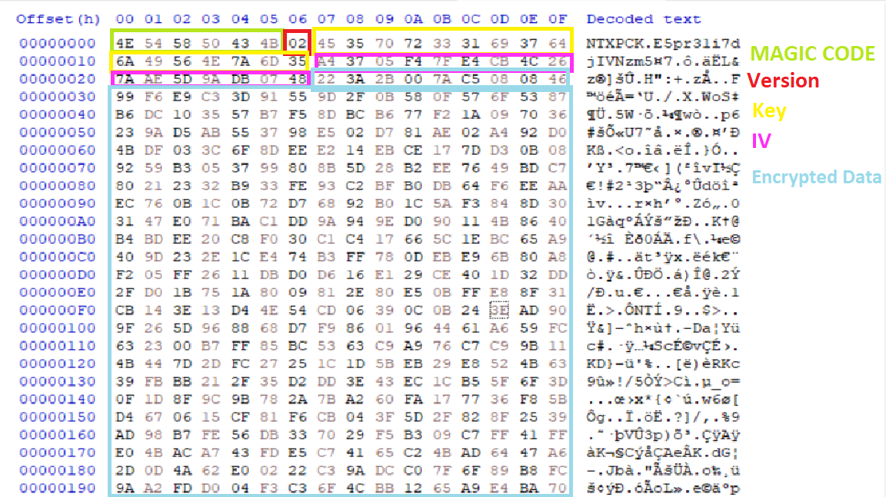

# PROJECT INFO
I make this project to learn more about file structure and encryption 
inspire after analyzing file structure from NIKKE assets files

## File Structure
The structure for the final will be like this 

The header size is **39 bytes** which consists of 
**Magic Code:** ***6 byte long*** 
**Version:** ***1 byte long*** 
**Key:** ***16 byte long*** 
**IV:** ***16 byte long*** 
and the rest is encrypted data